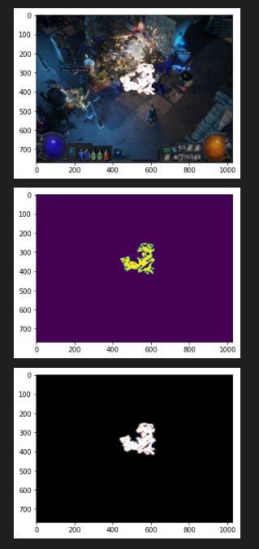
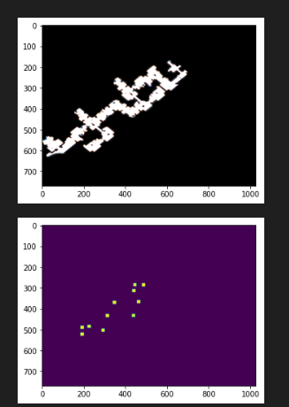
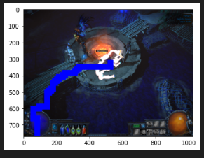
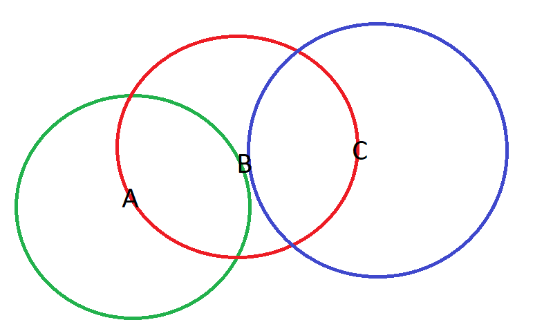

# Purpose and idea
The purpose of this project was about creating an automated software which will play videogame Path Of Exile by using computer vision techniques.
I've tried to reimplement it before [previous version](https://github.com/tachikoma-av/poe-bot), and this time, I was way more serious about it.

## Process
Firstly, I've tried to rework the navigation a bit, since it wasn't super stable approach.
[reworked navigation youtube](https://youtu.be/hFecxbeXKzQ)

Then, Ive found a way to make the map brighter which would make it more handy to read

Detecting objects on minimap, for basic navigation

Pathing A to B

Next problem I've faced during this project, was navigation.  
Assuming that we started from point A, and our goal is C, and there is a middle point B which is visible for both A and C. The transition from A to C and C to A is possible.  

  

But if we are trying to move from A to B and there are no anchors between A and B, transition from A to B may be achieved through discovery which I've found not that stable in most cases, since the game terrains may be complicated.

Also, there is a way of creating temporary map by merging current visible map terrains. But before attempting to implement this approach, I tried to make some research on this problem. And while I was looking for a solution on how to do it in a proper way, I've found that there are some projects which already reverese engineered the game, and extracted the terrain map, objects, and so on. I've decided to move towards raw data approach rather than image data approach, since it provides more information, more accurate, faster, etc. [abandoned public version](https://github.com/tachikoma-av/aqueduct_runner)